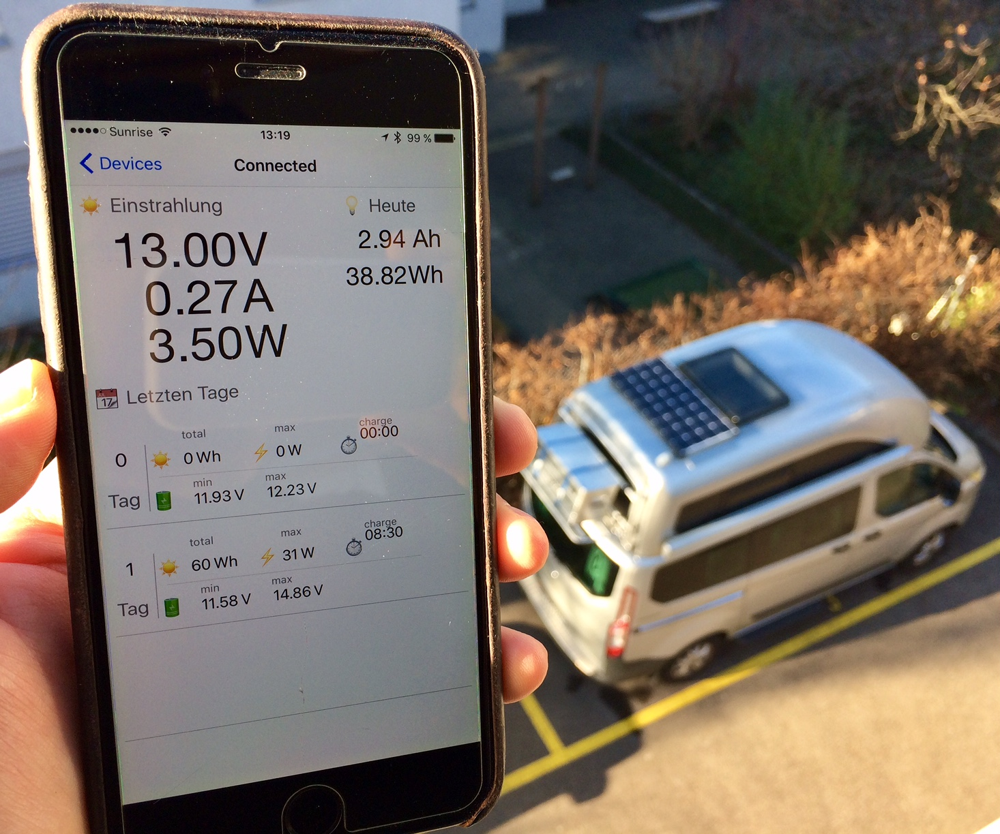
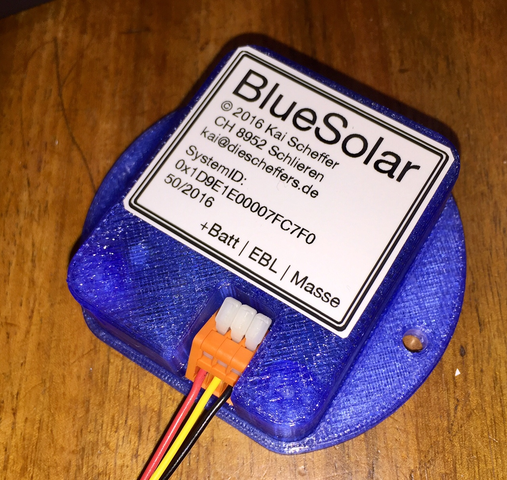
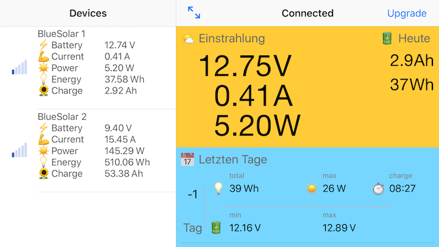

## BlueSolar - Solar Computer mit Bluetooth Interface

Das Projekt wurde inspiertiert durch das www.nuggetforum.de und www.poesslforum.de. Das System besteht aus einer kleinen Hardware und passender Software für ein Smartphone. Alle wichtigen Informationen zu der Solaranlage werden aufgezeichnet und mit dem Smartphone dann angezeigt. Damit entfällt eine zusätzliche Anzeige und die Installation wird dadurch wesentlich vereinfacht.

Weitere spezifische Informationen sind im Forum direkt hier zu finden:

* [Nuggetforum Thread](https://www.nuggetforum.de/forum/2-allgemeines/78722-solarcomputer-mit-bluetooth-im-eigenbau)
* [Pösslforum Thread](https://poesslforum.de/forum/elektrik/2705-solarcomputer-mit-bluetooth-im-eigenbau?start=30#34903)

### BlueSolar System

Das Sytem besteht aus einerm kleinen Gerät welches an dem Solarladeregler angeschlossen wird. Zum Anschluss werden nur 3 dünne Leitungen benötigt:

* +12 V der Batterie
* EBL-Ausgang des Ladereglers \*)
* Masse 

Der BlueSolar Computer erfasst die Spannung der Boardbatterie and den Ladestrom über den mit EBL bezeichneten Ausgang des Solarladereglers. Diese Daten werden dann kontinuierlich erfasst und daraus wichtige Kenndaten der Solaranlage errechnet.

Errechnet werden folgende Parameter:

* Momentane Spannung der Boardbatterie (Volt)
* Momentaner Ladestrom und Leistung (Ampere, Watt)
* Bisherige Tagesleistung (Ah, Wh)
* Tägliches Minimum and Maximum der Batteriespannung
* Tägliche maximale Solarleistung (Watt
* Tägliche Ladezeit (und Dunkelzeit) (Stunden:Minuten)

Zudem speichert BlueSolar täglich die wichtigsten Daten ab. Gespeichert werden mindestens die letzten 30 Tage (derzeit sind es 220 Tage).
 * Ladeenergie (Wh)
 * Maximale Solarleisting (Watt)
 * Ladezeit (Stunden:Minuten)
 * min/max Batteriespannung

### BlueSolar App

Zunächst ist eine iOS basierte App in der Entwicklung. Später erfolgt eine Android basierende Version (hier werden noch Software Entwickler gesucht).

Zum Beta Test der App benötigt es die Geräte UDID des jeweiligen iPhones order iPads, damit die App erfolgreich installiert werden kann. Diese UDID bitte **vorher** an @kscheff schicken, damit ich das dann einbauen kann. **Nach** bestätigung bitte erst die App hier laden und installieren.

| Icon | Link |
| --- | --- |
|  | <a href="itms-services://?action=download-manifest&url=https://github.com/kscheff/BlueSolar/releases/download/1.0.21/manifest.plist">BlueSolar 1.0.21 App</a> |
|  | <a href="itms-services://?action=download-manifest&url=https://github.com/kscheff/BlueSolar/releases/download/1.0.19/manifest.plist">BlueSolar 1.0.19 App</a> |
|  | <a href="itms-services://?action=download-manifest&url=https://github.com/kscheff/BlueSolar/releases/download/1.0.17/manifest.plist">BlueSolar 1.0.17 App</a> |
|  | <a href="itms-services://?action=download-manifest&url=https://github.com/kscheff/BlueSolar/releases/download/1.0.15/manifest.plist">BlueSolar 1.0.15 App</a> |
|  | <a href="itms-services://?action=download-manifest&url=https://github.com/kscheff/BlueSolar/releases/download/1.0.14/manifest.plist">BlueSolar 1.0.14 App</a> |
|  | <a href="itms-services://?action=download-manifest&url=https://github.com/kscheff/BlueSolar/releases/download/1.0.12/manifest.plist">BlueSolar 1.0.12 App</a> |
|  | <a href="itms-services://?action=download-manifest&url=https://github.com/kscheff/BlueSolar/releases/download/1.0.9/manifest.plist">BlueSolar 1.0.9 App</a> |
|  | <a href="itms-services://?action=download-manifest&url=https://github.com/kscheff/BlueSolar/releases/download/v0.1/manifest.plist">BlueSolar 0.1 App</a> |

\*) Bitte beachten: BlueSolar wird direkt am **Laderegler** angeschlossen. Mit EBL-Ausgang ist das Ausgangssignal des Ladereglers bezeichnet. Ein eventuell vorhandenes EBL System wird nicht benötigt oder angeschlossen. Sollte der EBL-Ausgang des Ladereglers bereits durch eine Solarstromanzeige eines EBL Systems belegt sein, so ersetzt BlueSolar diese Anzeige und das EBL-Ausgang des Ladereglers muss direkt mit BlueSolar verbunden werden. Eine manuelle Umschaltung dieses Ausgangs ist auch möglich, aber unterbricht den vollständigen Log und Anzeige im BlueSolar (nur die Batteriespannung bleibt gültig). 
