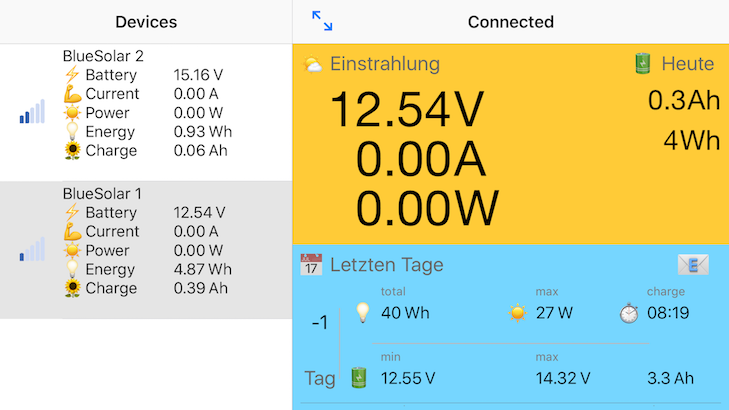

## BlueSolar - Solar Computer mit Bluetooth Interface

Das Projekt wurde inspiertiert durch das www.nuggetforum.de und www.poesslforum.de. Das System besteht aus einer kleinen Hardware und passender Software für ein Smartphone. Alle wichtigen Informationen zu der Solaranlage werden aufgezeichnet und mit dem Smartphone dann angezeigt. Damit entfällt eine zusätzliche Anzeige und die Installation wird dadurch wesentlich vereinfacht.

Weitere spezifische Informationen sind im Forum direkt hier zu finden:

* [fertige BlueSolar Geräte sind hier zu bekommen](https://www.blue-battery.com)
* [Nuggetforum Thread](https://www.nuggetforum.de/forum/2-allgemeines/78722-solarcomputer-mit-bluetooth-im-eigenbau)
* [Pösslforum Thread](https://poesslforum.de/forum/elektrik/2705-solarcomputer-mit-bluetooth-im-eigenbau?start=30#34903)

### BlueSolar System

Das Sytem besteht aus einerm kleinen Gerät welches an dem Solarladeregler angeschlossen wird. Zum Anschluss werden nur 3 dünne Leitungen benötigt:

* +12 V der Batterie
* EBL-Ausgang des Ladereglers \*)
* Masse 

Der BlueSolar Computer erfasst die Spannung der Boardbatterie and den Ladestrom über den mit EBL bezeichneten Ausgang des Solarladereglers. Diese Daten werden dann kontinuierlich erfasst und daraus wichtige Kenndaten der Solaranlage errechnet.

Errechnet werden folgende Parameter:

* Momentane Spannung der Boardbatterie (Volt)
* Momentaner Ladestrom und Leistung (Ampere, Watt)
* Bisherige Tagesleistung (Ah, Wh)
* Tägliches Minimum and Maximum der Batteriespannung
* Tägliche maximale Solarleistung (Watt
* Tägliche Ladezeit (Stunden:Minuten)

Zudem speichert BlueSolar täglich die wichtigsten Daten ab. Gespeichert werden mindestens die letzten 30 Tage (derzeit sind es 180 Tage).
 * Ladeenergie (Wh)
 * Ladung (Ah)
 * Maximale Solarleisting (Watt)
 * Ladezeit (Stunden:Minuten)
 * min/max Batteriespannung

### Installationsanleitung

Eine ausführliche Installationsanleitung ist hier [https://goo.gl/1DspP8](https://goo.gl/1DspP8) zu finden.

### BlueSolar App

#### Android

<a href="https://github.com/kscheff/BlueSolar/releases/download/Android-1.1.3/BlueSolar-1.1.3.apk">Download Android BlueSolar 1.1.3 App<a>

<a href="https://github.com/kscheff/BlueSolar/releases/download/Android-1.1.1/BlueSolar-1.1.1.apk">Download Android BlueSolar 1.1.1 App<a>

#### Apple iOS

| Icon | Link | Notiz |
| --- | --- | --- |
|  |  | Neueste Version, für jeden installierbar (auch ohne UDID) |
|  | <a href="itms-services://?action=download-manifest&url=https://github.com/kscheff/BlueSolar/releases/download/1.0.32/manifest.plist">BlueSolar 1.0.32 App</a> | Bei Erstinstallation wird ein BlueSolar Demo Gerät angelegt, damit die App auch ohne Hardware exploriert werden kann. |
|  | <a href="itms-services://?action=download-manifest&url=https://github.com/kscheff/BlueSolar/releases/download/1.0.21/manifest.plist">BlueSolar 1.0.21 App</a> | CSV Export via Email |
|  | <a href="itms-services://?action=download-manifest&url=https://github.com/kscheff/BlueSolar/releases/download/1.0.19/manifest.plist">BlueSolar 1.0.19 App</a> | Verbesserte Zählung der Log Einträge, Fehler verbessert |
|  | <a href="itms-services://?action=download-manifest&url=https://github.com/kscheff/BlueSolar/releases/download/1.0.17/manifest.plist">BlueSolar 1.0.17 App</a> | Errechnete Ah im Log |
|  | <a href="itms-services://?action=download-manifest&url=https://github.com/kscheff/BlueSolar/releases/download/1.0.15/manifest.plist">BlueSolar 1.0.15 App</a> | Gleich wie 1.0.14 mit weiteren UDIDs für Beta Tests. |
|  | <a href="itms-services://?action=download-manifest&url=https://github.com/kscheff/BlueSolar/releases/download/1.0.14/manifest.plist">BlueSolar 1.0.14 App</a> | Verbesserte Namen bei mehreren Devices |
|  | <a href="itms-services://?action=download-manifest&url=https://github.com/kscheff/BlueSolar/releases/download/1.0.12/manifest.plist">BlueSolar 1.0.12 App</a> | Speichert Geräte und Log |
|  | <a href="itms-services://?action=download-manifest&url=https://github.com/kscheff/BlueSolar/releases/download/1.0.9/manifest.plist">BlueSolar 1.0.9 App</a> | Verbessungen bzgl. der Anzeige auf verschiedenen iPhone Modellen. |
|  | <a href="itms-services://?action=download-manifest&url=https://github.com/kscheff/BlueSolar/releases/download/v0.1/manifest.plist">BlueSolar 0.1 App</a> | Erste Version |

##Technische Daten
<pre>
Kenndaten:
- Eingangspannungsbereich 5 V bis 30 V
- Stromverbrauch < 0.01 A (typ. 1.3 mA)
- Temperaturbereich -40 bis + 85 °C (nicht kondensierend)

Messbereiche:
- Batteriespannung (= Eingangsspannung) bis 30V, Genauigkeit 1%, 12-bit Auflösung bezogen auf 33V
- Ladestrom EBL-Eingang 0 - 1.5 mA (entspricht 0 - 30 A Ladestrom), Genauigkeit 1%, 12-bit Auflösung bezogen auf 33A

Bluetooth 4.0 (2.4 Ghz)
- Reichweite bis 50m im Freien (line of sight)
- Firmware automatischer Update über Bluetooth

Messungen:
- Kontinuierlich alle 2 Sekunden (16-fach Oversampling) von Strom, Spannung
- Erfassen von mW, mAh, mWh, Ladezeit bei Strommessung > 0.05 A, Pmax, Umin, Umax
- Strommessung Deadband < 0.05 A

Datenlog:
- Erfassung von Wh, Pmax, Umin, Umax, Ladezeit, Ah
- Automatischer Tagesrückstellung, jeweils um 00:00 Uhr
- Anzahl der maximalen Datensätze: 180 Tage
- Zeiteinstellung automatisch über Bluetooth
- Zugriff über Bluetooth, löschbar

Abmessungen:
- Grundplatte 68.2 mm Durchmesser, 2 Seiten abgeflacht 57.2 mm
- Höhe 21.2 mm
- 2 Befestigungsbohrungen, Durchmesser 3.8 mm, Abstand 58.5 mm

Gehäuse:
- PETG blau, durchscheinend (LED Indikator innenliegend)
- Gewicht ca. 35g

Anschluss:
- werkzeiglose 3-pol Klemmleiste bis 0.25 mm

Mitgeliefertes Zubehör:
- Anschlussleitung 3 x 0.14, Länge 1m

App:
- kostenlos im Apple App Store
- ab iOS 8.2
- iPhone (ab 4S) oder iPad (ab 3. Generation)
</pre>

\*) Bitte beachten: BlueSolar wird direkt am **Laderegler** angeschlossen. Mit EBL-Ausgang ist das Ausgangssignal des Ladereglers bezeichnet. Ein eventuell vorhandenes EBL System wird nicht benötigt oder angeschlossen. Sollte der EBL-Ausgang des Ladereglers bereits durch eine Solarstromanzeige eines EBL Systems belegt sein, so ersetzt BlueSolar diese Anzeige und das EBL-Ausgang des Ladereglers muss direkt mit BlueSolar verbunden werden. Eine manuelle Umschaltung dieses Ausgangs ist auch möglich, aber unterbricht den vollständigen Log und Anzeige im BlueSolar (nur die Batteriespannung bleibt gültig). 
